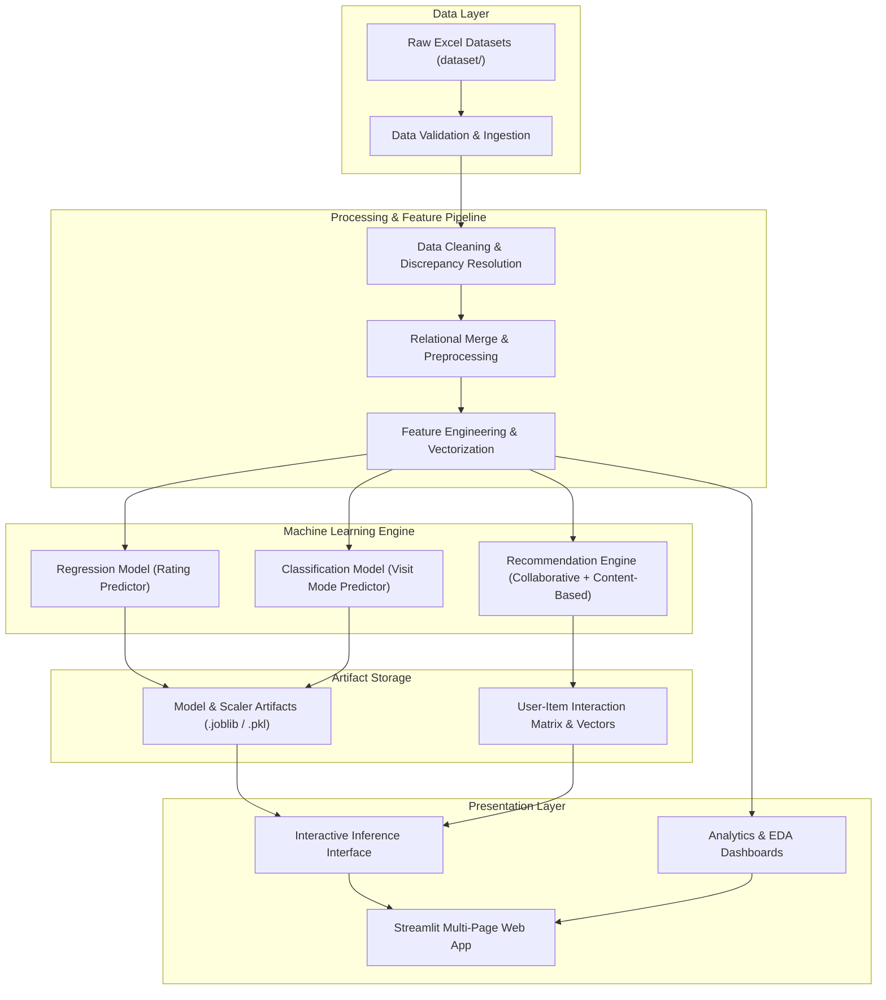
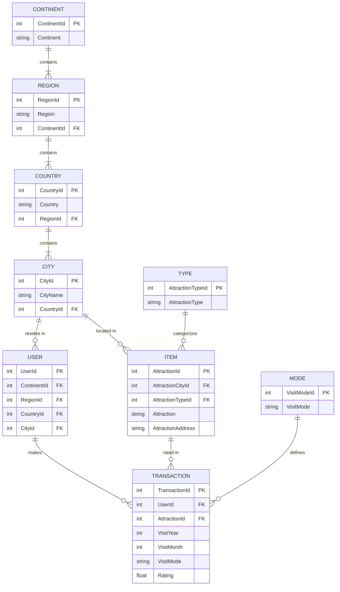
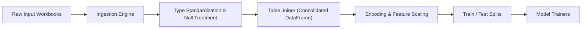
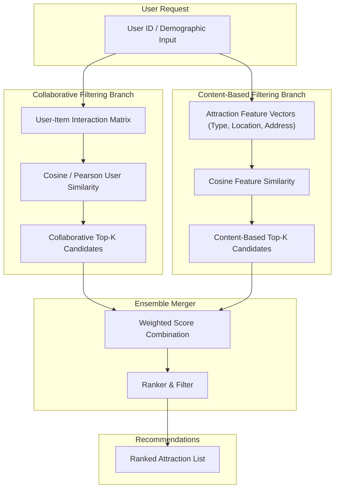
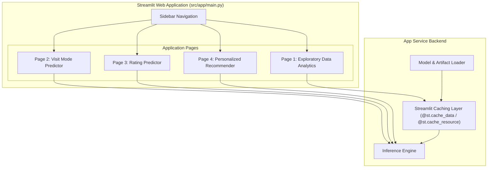

# System Architecture: Tourism Experience Analytics

## 1. High-Level System Architecture

The Tourism Experience Analytics system is designed as an end-to-end Machine Learning and Analytics platform. It ingests multi-relational tourism data, performs automated data cleaning and feature engineering, trains specialized machine learning models (Regression, Classification, Recommendation), and exposes interactive predictions and insights through a Streamlit web application.



---

## 2. Data Architecture & Relational Entity Model

The domain architecture relies on 9 interconnected relational tables. The Entity-Relationship Diagram below illustrates the relational mapping used during data consolidation:



---

## 3. Data Processing & Pipeline Architecture



### Data Pipeline Components

1. **Ingestion & Data Validation Layer**:
   - Reads `.xlsx` files from `dataset/`.
   - Validates schema compliance, data types, and primary key integrity.

2. **Cleaning & Transformation Module**:
   - **Missing Value Handling**: Imputes missing values based on demographic aggregations or category modes.
   - **Category Normalization**: Resolves duplicate or inconsistent strings in `VisitMode`, `AttractionType`, and `CityName`.
   - **Date Normalization**: Standardizes `VisitYear` and `VisitMonth` fields.
   - **Outlier Filtering**: Validates `Rating` range (1.0 to 5.0).

3. **Feature Engineering Store**:
   - **Demographic Features**: Encodes `ContinentId`, `CountryId`, `RegionId`, `CityId` using One-Hot / Label Encoding.
   - **Item Profile Aggregates**: Computes average ratings, total review counts, and visitor demographic distributions per attraction.
   - **User Behavior Vectors**: Derives user average rating per `VisitMode` and frequency of visits.

---

## 4. Machine Learning Subsystems

### Subsystem 1: Regression Architecture (Attraction Rating Predictor)
- **Target**: Continuous rating value $\in [1.0, 5.0]$.
- **Features**: User demographic encodings + Attraction type & location features + Temporal attributes (`VisitYear`, `VisitMonth`).
- **Algorithms**: Linear Regression, Random Forest Regressor, XGBoost Regressor, LightGBM Regressor.
- **Evaluation**: $R^2$, Mean Squared Error (MSE), Root Mean Squared Error (RMSE).

### Subsystem 2: Classification Architecture (Visit Mode Classifier)
- **Target**: Multi-class Visit Mode (`Business`, `Family`, `Couples`, `Friends`, `Solo`).
- **Features**: User origin demographics + Attraction features + Historical travel patterns.
- **Algorithms**: Random Forest Classifier, LightGBM Classifier, XGBoost Classifier.
- **Evaluation**: Accuracy, Precision, Recall, Macro/Weighted F1-Score.

### Subsystem 3: Hybrid Recommendation Engine



- **Collaborative Filtering**: Computes user-user or item-item similarity matrices on the sparse rating interaction matrix.
- **Content-Based Filtering**: Constructs TF-IDF / One-Hot feature vectors of attractions using `AttractionType`, `CityName`, and geographic parameters.
- **Hybrid Blending**: Combines normalized collaborative scores ($S_{CF}$) and content scores ($S_{CB}$) via weighted ensemble:
  $$S_{Hybrid} = \alpha \cdot S_{CF} + (1 - \alpha) \cdot S_{CB}$$

---

## 5. Streamlit Application Architecture

The user-facing presentation layer is structured as an interactive multi-page Streamlit app:



### Key Application Components
- **State Management**: Uses `st.session_state` to store user inputs, selected filters, and active recommendations.
- **Caching Layer**: Uses `@st.cache_data` for heavy dataframes and `@st.cache_resource` for loading machine learning models to ensure low latency.
- **Interactive Controls**: Inputs for User demographic parameters, target visit modes, and desired attraction categories.

---

## 6. Recommended Repository Structure

```text
Tourism Experience/
├── dataset/                                 # Raw input data files (.xlsx)
│   ├── Transaction.xlsx
│   ├── User.xlsx
│   ├── City.xlsx
│   ├── Type.xlsx
│   ├── Mode.xlsx
│   ├── Continent.xlsx
│   ├── Country.xlsx
│   ├── Region.xlsx
│   ├── Item.xlsx
│   └── Additional_Data_for_Attraction_Sites/
│       └── Updated_Item.xlsx
├── docs/                                    # Project documentation
│   ├── problemstatement.txt
│   ├── context.md
│   └── architecture.md
├── src/                                     # Core application source code
│   ├── data/                                # Data ingestion and preprocessing scripts
│   │   ├── loader.py
│   │   └── preprocessor.py
│   ├── features/                            # Feature engineering and vectorization
│   │   └── build_features.py
│   ├── models/                              # ML model definitions and training logic
│   │   ├── train_regression.py
│   │   ├── train_classification.py
│   │   └── recommendation.py
│   └── app/                                 # Streamlit UI application
│       ├── main.py                          # App entry point
│       └── pages/                           # Sub-pages (EDA, Models, Recommendations)
├── artifacts/                               # Serialized models and feature matrices (.joblib)
│   ├── regression_model.joblib
│   ├── classification_model.joblib
│   └── similarity_matrices.joblib
├── requirements.txt                         # Dependencies
└── README.md                                # Project introduction & setup guide
```
