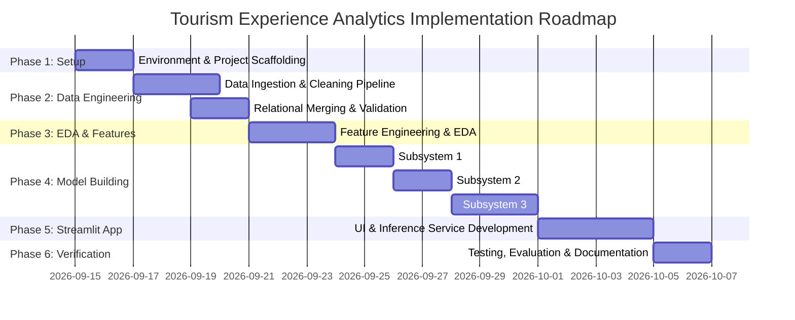

# Phase-Wise Implementation Plan: Tourism Experience Analytics

This document outlines the step-by-step technical implementation plan for building the end-to-end Tourism Experience Analytics platform based on [docs/architecture.md](file:///e:/Tourism%20Experience/docs/architecture.md).

## User Review Required

> [!IMPORTANT]
> - **Dataset Libraries**: The project uses `.xlsx` files in `dataset/`. The environment must have `openpyxl` installed along with `pandas`.
> - **Recommendation Cold Start Handling**: For users with no transaction history, the recommendation engine will fallback to Content-Based / Popularity-based attraction rankings.

## Open Questions

> [!NOTE]
> - What hyperparameter optimization limits (e.g., GridSearch / RandomSearch iteration budget) should be applied during model training to balance training time vs accuracy?
> - Should the Streamlit application be configured for single-page multi-tab layout or native Streamlit multi-page (`pages/` directory) layout? (Recommended: Multi-page layout).

---

## Proposed Implementation Phases

---

### Phase 1: Environment Setup & Workspace Scaffolding

Set up repository directories, dependencies, and environment configuration.

#### [NEW] [requirements.txt](file:///e:/Tourism%20Experience/requirements.txt)
Define project dependencies: `pandas`, `numpy`, `openpyxl`, `scikit-learn`, `lightgbm`, `xgboost`, `streamlit`, `plotly`, `joblib`.

#### [NEW] [src/__init__.py](file:///e:/Tourism%20Experience/src/__init__.py)
Initialize core Python package.

---

### Phase 2: Data Ingestion & Cleaning Pipeline

Build modular scripts to load, clean, join, and validate raw Excel datasets from `dataset/`.

#### [NEW] [src/data/loader.py](file:///e:/Tourism%20Experience/src/data/loader.py)
- Functional module to load all 9 Excel workbooks (`Transaction.xlsx`, `User.xlsx`, `City.xlsx`, `Type.xlsx`, `Mode.xlsx`, `Continent.xlsx`, `Country.xlsx`, `Region.xlsx`, `Item.xlsx`, `Updated_Item.xlsx`).

#### [NEW] [src/data/preprocessor.py](file:///e:/Tourism%20Experience/src/data/preprocessor.py)
- **Cleaning logic**:
  - Impute missing values in `User` and `Transaction` datasets.
  - Standardize text columns (`VisitMode`, `AttractionType`, `CityName`).
  - Validate and clamp `Rating` values within range $[1.0, 5.0]$.
  - Merge relational tables into a consolidated master `DataFrame`.

---

### Phase 3: Feature Engineering & Exploratory Data Analysis (EDA)

Extract statistical features, encode categorical variables, and generate insight visualizations.

#### [NEW] [src/features/build_features.py](file:///e:/Tourism%20Experience/src/features/build_features.py)
- Categorical encoding (Label Encoding / One-Hot Encoding for demographics and attraction types).
- User profile aggregations (User average rating, favorite visit mode count).
- Attraction feature vectorization (TF-IDF / One-Hot representation of attraction features).
- Feature scaling using `StandardScaler` / `MinMaxScaler`.

#### [NEW] [notebooks/01_eda_and_insights.ipynb](file:///e:/Tourism%20Experience/notebooks/01_eda_and_insights.ipynb)
- Interactive notebook documenting demographic distributions, attraction rating trends, temporal heatmaps, and visit mode correlations.

---

### Phase 4: Machine Learning Model Development

Build, evaluate, and serialize the three ML subsystems.

#### [NEW] [src/models/train_regression.py](file:///e:/Tourism%20Experience/src/models/train_regression.py)
- **Predicting Attraction Ratings**:
  - Train Linear Regression, Random Forest Regressor, LightGBM Regressor, XGBoost Regressor.
  - Metrics: $R^2$, MSE, RMSE.
  - Serializes best model to `artifacts/regression_model.joblib`.

#### [NEW] [src/models/train_classification.py](file:///e:/Tourism%20Experience/src/models/train_classification.py)
- **User Visit Mode Prediction**:
  - Train Random Forest Classifier, LightGBM Classifier, XGBoost Classifier.
  - Metrics: Accuracy, Precision, Recall, Macro/Weighted F1-Score.
  - Serializes best classifier to `artifacts/classification_model.joblib`.

#### [NEW] [src/models/recommendation.py](file:///e:/Tourism%20Experience/src/models/recommendation.py)
- **Hybrid Recommendation Engine**:
  - `CollaborativeRecommender`: Constructs sparse User-Item rating matrix, computes User/Item Cosine Similarity.
  - `ContentBasedRecommender`: Computes attraction similarity matrix based on attraction type, city, and metadata vectors.
  - `HybridRecommender`: Blends collaborative and content-based scores ($S_{Hybrid} = \alpha S_{CF} + (1-\alpha) S_{CB}$).
  - Serializes matrices to `artifacts/similarity_matrices.joblib`.

---

### Phase 5: Streamlit Web Application Development

Develop a responsive, multi-page Streamlit application offering interactive inference and analytics dashboards.

#### [NEW] [src/app/main.py](file:///e:/Tourism%20Experience/src/app/main.py)
- Main entry point with sidebar navigation, session state initialization, and CSS styling.

#### [NEW] [src/app/pages/01_EDA_Dashboard.py](file:///e:/Tourism%20Experience/src/app/pages/01_EDA_Dashboard.py)
- Displays interactive Plotly charts showing visitor distributions, top-rated attractions, and regional travel trends.

#### [NEW] [src/app/pages/02_Visit_Mode_Predictor.py](file:///e:/Tourism%20Experience/src/app/pages/02_Visit_Mode_Predictor.py)
- Interactive form for user origin demographics and travel context $\rightarrow$ outputs predicted `VisitMode` with confidence probabilities.

#### [NEW] [src/app/pages/03_Rating_Predictor.py](file:///e:/Tourism%20Experience/src/app/pages/03_Rating_Predictor.py)
- User inputs specific attraction & visit parameters $\rightarrow$ outputs predicted attraction rating ($1 - 5$).

#### [NEW] [src/app/pages/04_Attraction_Recommender.py](file:///e:/Tourism%20Experience/src/app/pages/04_Attraction_Recommender.py)
- Personalized recommendations engine UI: User enters User ID or demographic preferences $\rightarrow$ displays ranked top-K attraction recommendations with details and ratings.

---

### Phase 6: System Verification & Documentation

Ensure complete system functionality, model validation, and user guide creation.

#### [NEW] [README.md](file:///e:/Tourism%20Experience/README.md)
- Complete project README with installation commands, usage instructions, architecture overview, and evaluation results.

---

## Verification Plan

### Automated Verification
1. **Data Pipeline Test**: Verify data ingestion loads all rows without schema errors (`python -m unittest tests/test_loader.py` or script verification).
2. **Model Training Test**: Verify training scripts execute end-to-end, generating non-null metrics and valid `.joblib` model artifacts.
3. **App Smoke Test**: Launch Streamlit app (`streamlit run src/app/main.py`) to confirm no syntax or runtime errors occur.

### Manual Verification
- Test Streamlit web interface page by page (EDA charts render correctly, Visit Mode prediction outputs expected category, Rating prediction outputs valid floats $1-5$, Recommendation tab outputs ranked attractions).
